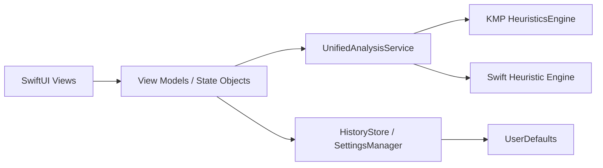

# iOS Architecture

## Overview
The iOS app follows a pragmatic SwiftUI + service-layer design with optional Kotlin Multiplatform integration.

## Layers
- Presentation: SwiftUI screens under `MehrGuard/UI`.
- Domain/service: analysis and compatibility models under `MehrGuard/Models`.
- Platform integration: camera, notifications, and deep-link handling in app/runtime components.
- Persistence: lightweight state and history via `UserDefaults`.

## Key Design Decisions
- Compile-time guards around optional modules (`canImport(common)`) keep iOS-only builds functional.
- Analysis output is normalized to shared UI-facing models (`RiskAssessmentMock`), avoiding view branching.
- iOS-only APIs are guarded with `#if os(iOS)` for safer SwiftPM compatibility.

## Operational Notes
- Primary deployment path is Xcode project + simulator/device.
- SwiftPM support is retained for lightweight static checks and package tests.
