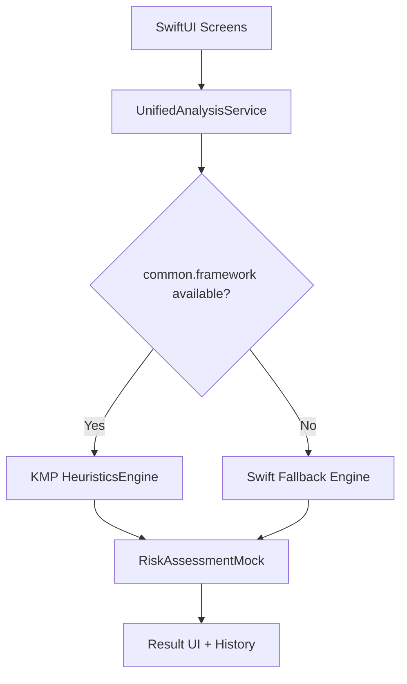

# iOS Integration Guide

This guide explains how the iOS app integrates shared Kotlin logic and how runtime fallback behaves when Kotlin artifacts are unavailable.

## Integration Model



## Entry Points
- App entry: `MehrGuard/App/MehrGuardApp.swift`
- Unified engine adapter: `MehrGuard/Models/UnifiedAnalysisService.swift`
- Optional bridge to KMP model types: `MehrGuard/Models/KMPBridge.swift`
- Compose interoperability shim: `MehrGuard/ComposeInterop.swift`

## Build and Link KMP Framework (Optional)

Run from `iosApp/`:
```bash
./scripts/build_framework.sh
```

The script:
1. Locates `gradlew` at `iosApp/` or parent directory.
2. Builds `:common:linkDebugFrameworkIosSimulatorArm64`.
3. Copies framework to `iosApp/Frameworks/common.framework`.

If `gradlew` is not present (iOS-only checkout), the script exits with a clear message and the app remains operable using Swift fallback.

## Runtime Selection
`UnifiedAnalysisService` detects KMP availability at compile-time via:
- `#if canImport(common)`

Behavior:
- `true`: calls `HeuristicsEngine.analyze(url:)` in KMP framework.
- `false`: executes Swift heuristic analysis and returns compatible view models.

## Validation Checklist
1. Build and run with framework linked.
2. Confirm engine badge shows KMP engine.
3. Temporarily remove framework link and rebuild.
4. Confirm app still runs and engine badge indicates Swift fallback.
5. Execute unit tests and smoke UI flow.

## Troubleshooting
### No such module `common`
- Expected in iOS-only checkout.
- Keep framework imports guarded with `#if canImport(common)`.
- Use Swift fallback path until framework is available.

### Framework build script fails
- Verify monorepo root contains `gradlew` and `common/` module.
- Run the script from `iosApp/` exactly.

### Tests not discovered in SwiftPM
- Ensure `Tests/MehrGuardPackageTests` exists.
- Ensure `Package.swift` contains `.testTarget(...)`.
